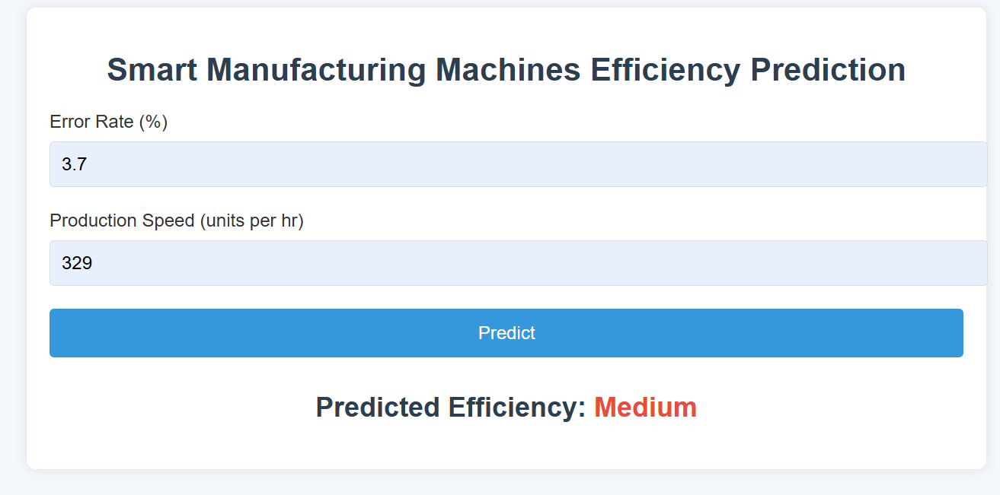
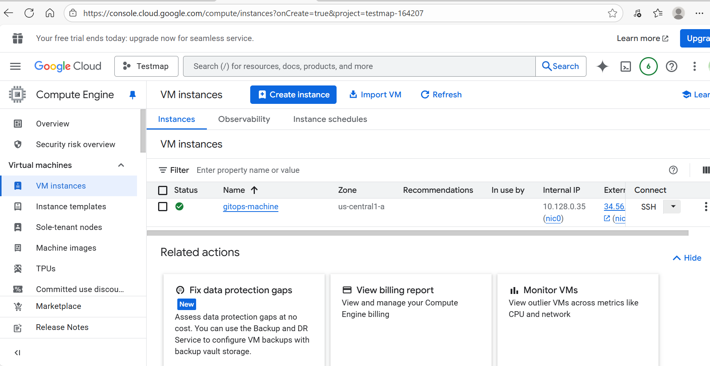
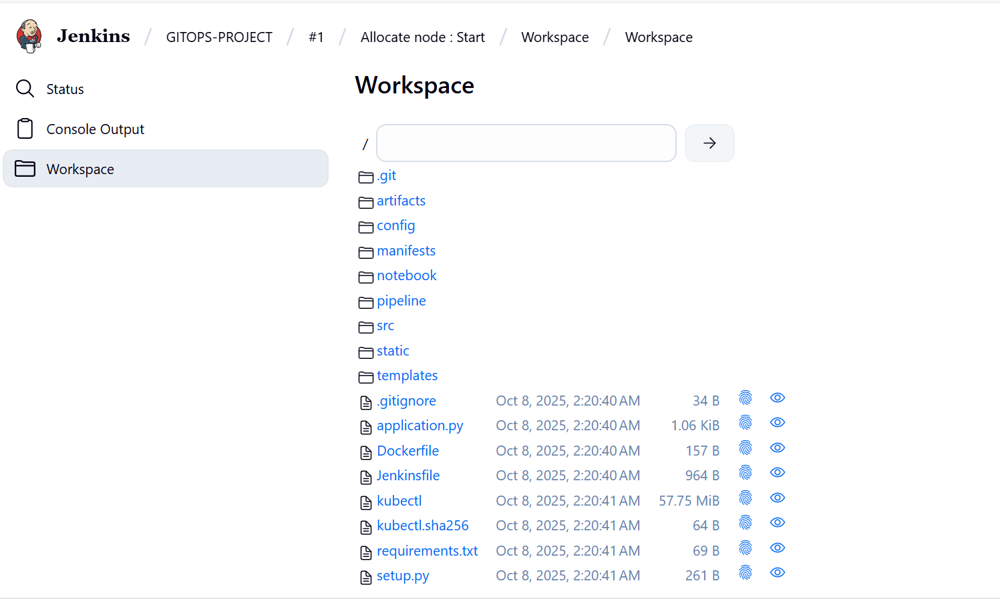
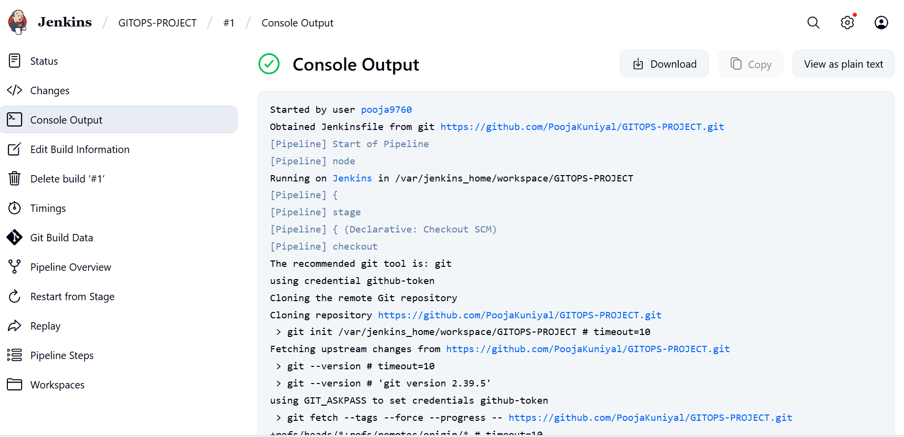

# 🔧 Smart Manufacturing Machines Efficiency Prediction (MLOps Project)

This project focuses on predicting the efficiency of smart manufacturing machines using machine learning techniques integrated into a full MLOps pipeline. Designed with GitOps, Jenkins, Argo CD, and Kubernetes (Minikube) on a Google Cloud VM, the system ensures scalable CI/CD deployment with reproducible ML workflows.

---

## 🧠 Project Overview

- **Goal:** Predict machine efficiency for smart manufacturing systems using historical sensor and operational data.
- **Use Cases:**
  - Predictive maintenance (e.g., detecting machines likely to fail).
  - Production cost optimization.
  - Efficiency monitoring for industrial equipment (e.g., automotive manufacturing).

---

## 📊 Dataset & Preprocessing

- **Features:**
  - `Timestamp` (converted to datetime components)
  - `Machine_ID`
  - `Operation_Mode`
  - `Temperature_C`
  - `Vibration_Hz`
  - `Power_Consumption_kW`
  - `Error_Rate_%` ✅
  - `Production_Speed_units_per_hr` ✅

- **Data Observations:**
  - Uniform distribution across multiple features (likely synthetic or engineered).
  - Label encoding applied to categorical fields.
  - StandardScaler used for normalization.
  - Extracted datetime components from Timestamp for temporal analysis.

---

## 🧪 Feature Selection & Modeling

- **Feature Selection:**
  - Used **permutation importance**.
  - Retained only top 2 features:
    - `Error_Rate_%` (23.5% importance)
    - `Production_Speed_units_per_hr` (11.8% importance)
  - Remaining features contributed < 1% cumulatively and added noise.

- **Model:**
  - **Logistic Regression**
    - Chosen for small model size and compatibility with low-memory VM instances.
    - Ideal for cloud deployment (minimal resource consumption).

---

## 🚀 MLOps Pipeline Architecture

### ✅ What’s Done

- **📁 Data & Code Versioning:** GitHub
- **🛠️ Model Training & Export:** Pickle format
- **📦 Dockerized Flask App:** Serves predictions
- **📦 CI - Jenkins:**
  - Set up on GCP VM
  - GitHub integration complete
  - CI pipeline builds and pushes Docker images
- **☁️ Google Cloud VM:**
  - Minikube, Jenkins, kubectl installed
- **📄 Kubernetes Manifests:** Created for deployment

### 🔄 To-Do (Future Work)

- **🔗 Installation of ArgoCD and GitHub Webhooks for Jenkins:** Automate builds on push
- **🚀 Argo CD Configuration:**
  - Set up GitHub repo sync
  - Enable automatic deployment from Git updates

---

## 🔧 Tools & Technologies Used

| Tool              | Purpose                                 |
|-------------------|-----------------------------------------|
| Python            | Data processing & ML                    |
| Flask             | Serving model as API                    |
| Docker            | Containerizing the app                  |
| Kubernetes        | Container orchestration (Minikube)      |
| Jenkins           | Continuous Integration                  |
| Argo CD           | Continuous Deployment (GitOps)          |
| GitHub            | Source code & data versioning           |
| Google Cloud VM   | Hosting the entire infrastructure       |

---

## 📸 Screenshots

Add the images below with correct file paths or URLs from your GitHub repo or upload them directly.

1. **FLASK APP**
   
   
2. **VM**
   
   
3. **VM Script Shell**
   
   
4. **Jenkins Workspace**
   
   
5. **Jenkins Build**
   

