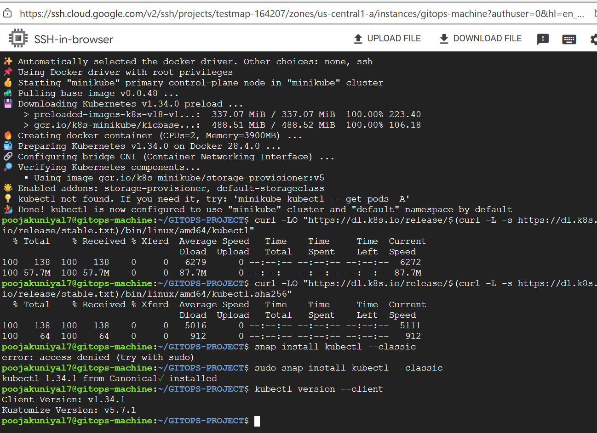

🔧 Smart Manufacturing Machines Efficiency Prediction (MLOps Project)
This project focuses on predicting the efficiency of smart manufacturing machines using machine learning techniques integrated into a full MLOps pipeline. Designed with GitOps, Jenkins, Argo CD, and Kubernetes (Minikube) on a Google Cloud VM, the system ensures scalable CI/CD deployment with reproducible ML workflows.

--
🧠 Project Overview
•	Goal: Predict machine efficiency for smart manufacturing systems using historical sensor and operational data.
•	Use Cases:
o	Predictive maintenance (e.g., detecting machines likely to fail).
o	Production cost optimization.
o	Efficiency monitoring for industrial equipment (e.g., automotive manufacturing).

--

📊 Dataset & Preprocessing
•	Features:
o	Timestamp (converted to datetime components).
o	Machine_ID
o	Operation_Mode
o	Temperature_C
o	Vibration_Hz
o	Power_Consumption_kW
o	Error_Rate_% ✅
o	Production_Speed_units_per_hr ✅
•	Data Observations:
o	Uniform distribution across multiple features (likely synthetic or engineered).
o	Label encoding applied to categorical fields.
o	StandardScaler used for normalization.
o	Extracted datetime components from Timestamp for temporal analysis.

--
🧪 Feature Selection & Modeling
•	Feature Selection:
o	Used **permutation importance**.
o	Retained only top 2 features:
	Error_Rate_% (23.5% importance)
	Production_Speed_units_per_hr (11.8% importance)
o	Remaining features contributed < 1% cumulatively and added noise.
•	Model:
o	**Logistic Regression**
	Chosen for small model size and compatibility with low-memory VM instances.
	Ideal for cloud deployment (minimal resource consumption).
________________________________________
🚀 MLOps Pipeline Architecture
✅ What’s Done
•	📁 Data & Code Versioning: GitHub
•	🛠️ Model Training & Export: Pickle format
•	📦 Dockerized Flask App: Serves predictions 
•	📦 CI - Jenkins: Set up on GCP VM
o	GitHub integration complete
o	CI pipeline builds and pushes Docker images
•	☁️ Google Cloud VM:
o	Minikube, Jenkins, kubectl installed
•	📄 Kubernetes Manifests: Created for deployment
🔄 To-Do (Future Work)
•	🔗 Installaton of argoCD and GitHub Webhooks for Jenkins: Automate builds on push
•	🚀 Argo CD Configuration:
o	Set up GitHub repo sync
o	Enable automatic deployment from Git updates

--
🔧 Tools & Technologies Used
Tool	Purpose
Python	Data processing & ML
Flask	Serving model as API
Docker	Containerizing the app
Kubernetes	Container orchestration (Minikube)
Jenkins	Continuous Integration
Argo CD	Continuous Deployment (GitOps)
GitHub	Source code & data versioning
Google Cloud VM	Hosting the entire infrastructure

--
📸 Screenshots
📌 Add the images below with correct file paths or URLs from your GitHub repo or upload them directly.
1.	FLASK APP
 
2.	VM
 
3.	VM Script shell
 
4.	Jenkins
 
5.	Jenkins build
 

